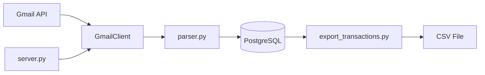

# AutoBudget - AI Agent Context

> **Last Updated**: 2026-01-14
> **Maintainer**: Update this file whenever adding features or modifying architecture.

## Overview

AutoBudget is a Python automation tool that scrapes transaction emails from Gmail, parses financial data (date, amount, vendor), and stores them in PostgreSQL.

## Architecture



## Project Structure

```
AutoBudget/
├── gmail_client.py      # Core pipeline: Gmail fetch → parse → DB insert
├── server.py            # Flask server with /run endpoint (port 3000)
├── export_transactions.py # CSV export utility
├── db_init.sql          # Schema: folders & messages tables
├── config.json          # User config (gitignored)
├── example_config.json  # Config template
├── utils/
│   ├── config.py        # Config loader with folder/pattern accessors
│   ├── db.py            # PostgreSQL connector with auto-schema init
│   ├── parser.py        # HTML cleaning, regex/delimiter extraction
│   ├── cache.py         # JSON-based API response cache
│   ├── fs.py            # Env var → file initialization for deployment
│   └── logging_utils.py # ListHandler for capturing logs
├── emails/              # Saved email content (gitignored)
├── credentials.json     # Google OAuth credentials (gitignored)
└── token.json           # OAuth token (gitignored)
```

## Key Components

### GmailClient (`gmail_client.py`)

- **Authentication**: OAuth2 via `credentials.json` → generates `token.json`
- **Rate Limiting**: Exponential backoff (2^n + 1 seconds) on 429 errors
- **Caching**: Stores label IDs and message content in `cache.json`
- **Entry Point**: `main()` orchestrates the full pipeline

### Config (`utils/config.py`)

Provides accessors for:
- `get_folders(type)` - List of Gmail labels to monitor
- `get_match_pattern(folder)` - Extraction patterns per email source
- `get_db_details()` - Database connection parameters

### Parser (`utils/parser.py`)

Two extraction modes:
1. **Delimiter-based**: `["start text", "end text"]` for simple emails
2. **Regex-based**: `use_regex: true` with capture groups

Key functions:
- `clean_html()` - Strips scripts/styles, normalizes whitespace
- `find_matches_from_pattern()` - Extracts amount/date/vendor
- `assert_date()` - Validates and standardizes dates

### Database Schema

```sql
folders (id, email_server, folder_name, last_trans_date)
messages (id, folder_id, content, transaction_date, transaction_vendor, transaction_amount, loaded_at)
```

- `last_trans_date` enables incremental sync
- `ON CONFLICT (id) DO NOTHING` prevents duplicates

## Configuration Format

```json
{
  "database_details": { "host", "db_name", "user", "password", "port" },
  "clients": [{
    "name": "Display Name",
    "type": "gmail",
    "folder": "Gmail_Label",
    "match_pattern": {
      "use_regex": false,
      "amount": ["before $", "after"],
      "date": ["Date:", "Time:"],
      "vendor": ["at ", " for"]
    }
  }]
}
```

## Common Tasks

### Adding a New Email Source

1. Create Gmail label/filter for the new source
2. Add client entry to `config.json`:
   - Set `folder` to exact Gmail label name
   - Configure `match_pattern` (test with sample emails)
3. Run pipeline to verify extraction

### Running Locally

```bash
python gmail_client.py    # Direct execution
python server.py          # Start Flask server, then GET /run
```

### Exporting Data

```bash
python export_transactions.py  # Exports to configured EXPORT_PATH
```

## Dependencies

Core: `google-api-python-client`, `google-auth-oauthlib`, `psycopg2-binary`, `Flask`, `beautifulsoup4`, `python-dateutil`

## Special Handling

- **KRW Currency**: Auto-converts Korean Won to USD (ratio: 1388.88)
- **Vendor Truncation**: Names capped at 40 characters
- **HTML Decoding**: Handles base64 URL-safe encoding with padding fix
