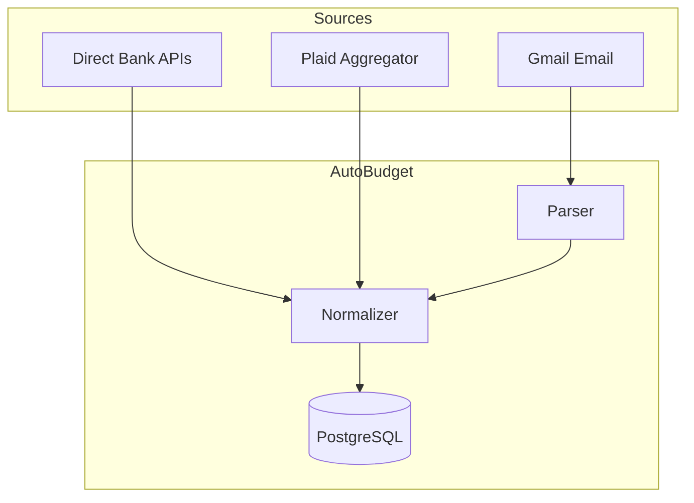

# API Integration Roadmap

> **Last Updated:** 2026-01-14  
> **Status:** Waiting for CFPB Section 1033 (April 2026)

## Overview

This document tracks the feasibility of migrating AutoBudget from email scraping to direct bank API access for transaction data.

---

## Current Approach: Email Scraping

AutoBudget currently parses transaction notification emails from Gmail labels. While functional, this approach has limitations:
- Requires manual Gmail label/filter setup per card
- Dependent on email format consistency
- Slight delay from transaction to email arrival

---

## API Integration Options

### 1. Financial Data Aggregators

Aggregators act as middlemen between your app and financial institutions.

| Aggregator | Free Tier | Coverage | Notes |
|------------|-----------|----------|-------|
| **Plaid** | 100 items (dev) | 10,000+ FIs | Most popular, `/transactions/get` endpoint |
| **MX** | Contact sales | 48,000 connections | Best data enrichment |
| **Yodlee** | Contact sales | 20,000+ sources | Enterprise-focused |

### 2. Direct Bank APIs

| Bank | Individual Access | Status |
|------|------------------|--------|
| **Amex** | ✅ Yes | Account & Transaction API via [developer.americanexpress.com](https://developer.americanexpress.com) |
| **Citi** | ⚠️ Enterprise-focused | Portal at [developer.citi.com](https://developer.citi.com) |
| **Chase** | ❌ Partnership required | FDX member, but contracted access only |
| **Capital One** | ❌ Enterprise only | DevExchange is company-gated |

### 3. FDX Standard (Emerging)

The Financial Data Exchange (FDX) provides a standardized API format. Major banks (Chase, Wells Fargo, Citizens) are adopting this. Access currently requires partnership agreements.

---

## Regulatory Timeline

### CFPB Section 1033 ("Personal Financial Data Rights")

| Date | Milestone |
|------|-----------|
| Oct 2024 | Rule finalized |
| Jan 2025 | FDX recognized as standard-setting body |
| **Apr 2026** | **Large institutions must comply** |
| 2027-2028 | Smaller institutions phase in |

**What this means:** Banks must allow customers to share financial data with authorized third-party applications. This will:
- Improve aggregator connection reliability
- Potentially open direct API access for individuals
- Replace legacy screen-scraping with secure OAuth flows

---

## Decision: Wait Until April 2026

**Rationale:**
1. Current email scraping works adequately
2. Direct bank APIs (except Amex) require enterprise partnerships
3. Section 1033 compliance will likely improve access options
4. Plaid remains viable backup if needed sooner

**Revisit Date:** April 2026

---

## Alternative Methods (If Needed)

### Manual CSV/OFX Import
Nearly every bank allows CSV/OFX download. Could add an "Upload" feature.

### LLM-Powered Extraction
Use AI (Gemini/OpenAI) to parse PDF bank statements into structured JSON. Tools like Unstract or LLMWhisperer specialize in this.

| Method | Effort | Cost | Reliability |
|--------|--------|------|-------------|
| Aggregator (Plaid) | Low | Free (dev tier) | High |
| Direct Bank API | High | Free | Highest |
| Manual CSV/PDF | Medium | Free | Manual effort |

---

## Future Architecture (Post-April 2026)

---

## References

- [CFPB Section 1033 Rule](https://www.consumerfinance.gov/rules-policy/final-rules/personal-financial-data-rights/)
- [Financial Data Exchange (FDX)](https://financialdataexchange.org/)
- [Plaid Documentation](https://plaid.com/docs/)
- [Amex Developer Portal](https://developer.americanexpress.com)
